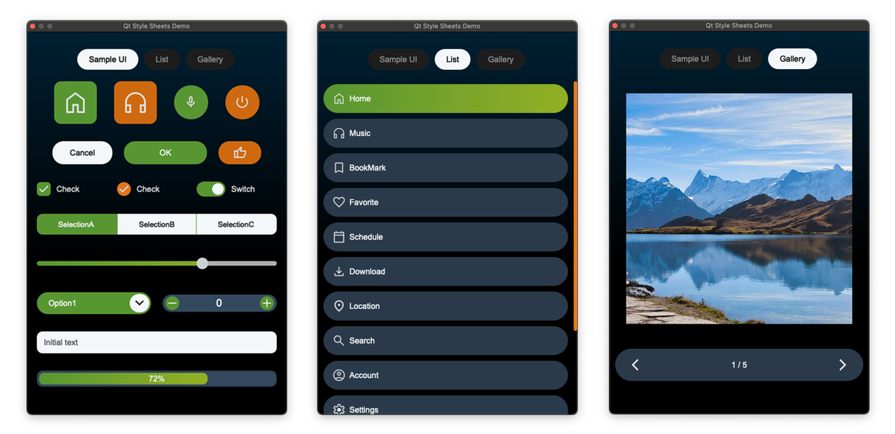

# QSS Demo Plugin

A QGIS plugin demonstrating Qt Style Sheets (QSS) customization.

## License

**GPL-2.0-or-later** - See [LICENSE](LICENSE)

## Third-Party Assets

### Material Design Icons

- **Source**: [Material Design Icons](https://github.com/google/material-design-icons)
- **License**: Apache 2.0 - [Full License](LICENSE-ICONS.txt)
- **Copyright**: Google LLC

### Images

- **Source**: [Pixabay](https://pixabay.com)
- **License**: Pixabay License
- Images are used under Pixabay License, which allows free use without attribution.

## Credits

- Material Design Icons by Google
- Images from Pixabay contributors
